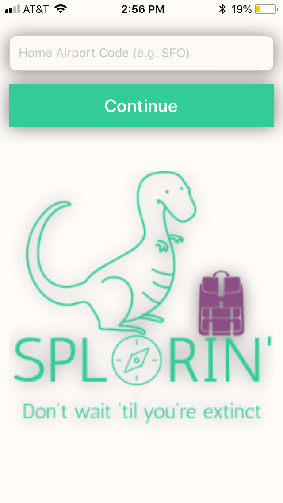

# Splorin'

Splorin' is a travel-inspiration mobile app. Decision paralysis is crippling when it comes to figuring out where to go on vacation when there are so many wonderful places to visit. Splorin' helps users realize how easy it is to access amazing destinations all around the world, and have fun doing it. Users simply enter their home airport and travel dates, and then start Splorin'. They will then be presented with images from some of the most breathtaking vacation destinations around the world. If a user is feeling inspired, all it takes is a swipe to the right and since the app is plugged into the Kiwi API, they will then see flight costs to their desired destination. On the other hand, if they aren't excited, they can simply left swipe and the app will bring up a new travel destination.

## Screenshots

Landing Page:
----------------------------------------------------------------------------------------------
 "LandingPage")

## Technology Stack

Front End: React Native

State Management: Redux

## What's next for Splorin'?

Splorin' is in a proof of concept stage. Some major changes need to be made in terms of structure to move travel destinations from being stored in the state to being held in a database. Also after making that transition, the app needs to dramatically increase the number of travel destinations included in the app, so users can have fun imagining future vacations for more than 5 minutes.

In terms of functionality, the next step for Splorin' is to build out the capacity for a user to save a travel destination. Currently a user can book a trip or keep searching, but often a travel decision isn't that binary. Perhaps a user doesn't have a long enough vacation to travel from California to Patagonia, but they may want to keep an eye on this destination for future trips.